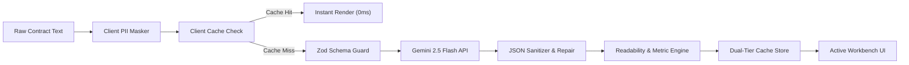

# LexiGuard AI — Architectural Specification

> **Event**: Google PromptWars: Virtual (Exclusive Edition)  
> **Track**: AI for Legal Assistance & Access  
> **Engine**: Google Gemini 2.5 Flash (`gemini-2.5-flash`)  
> **Framework**: Next.js 14 (App Router) + TypeScript + Tailwind CSS  
> **Deployment**: Vercel Serverless Edge  

---

## 1. System Philosophy & Non-Advisory Legal Boundary

LexiGuard AI operates under the strict legal paradigm of **Informational Legal Navigation & Risk Deconstruction**. It does not practice law or render formal legal counsel. Instead, it bridges the justice gap for freelancers, small business owners, tenants, and consumers by translating opaque, asymmetric legalese into transparent, plain-English risk assessments with structured what-if scenarios and negotiation levers.

```
+-------------------------------------------------------------------------+
|                          LexiGuard Client (Browser)                     |
|                                                                         |
|  +--------------------+   +-------------------+   +------------------+  |
|  | Accessibility Hook |   | Contract Ingest   |   | Client PII Vault |  |
|  | - WCAG AAA Tokens  |   | - Presets/Custom  |   | - Regex & Entity |  |
|  | - Keyboard (1-5,?) |-->| - Word/Char Guard |-->|   Masking        |  |
|  | - Screen Announcer |   | - Debounced Input |   | - Zero PII sent  |  |
|  +--------------------+   +-------------------+   +--------+---------+  |
|                                                            |            |
|  +---------------------------------------------------------v---------+  |
|  |                    Dual-Tier Client Cache                         |  |
|  |   - Level 1: In-Memory Map (0ms repeat lookups)                   |  |
|  |   - Level 2: Browser SessionStorage (tab persistence)             |  |
|  +-----------------------------+-------------------------------------+  |
+--------------------------------|----------------------------------------+
                                 | HTTPS / JSON Payload (POST)
                                 v
+-------------------------------------------------------------------------+
|                     Next.js Edge & API Route Gateway                    |
|                                                                         |
|  +--------------------+   +-------------------+   +------------------+  |
|  | Security Middleware|   | Runtime Validation|   | Server Cache Tier|  |
|  | - CSP, COOP, HSTS  |-->| - Strict Zod      |-->| - LRU Memory     |  |
|  | - Sliding Rate-Lim |   |   Schema Parser   |   |   (1 hr TTL)     |  |
|  +--------------------+   +-------------------+   +--------+---------+  |
+------------------------------------------------------------|------------+
                                                             |
                                                             v
+-------------------------------------------------------------------------+
|                  Google Gemini 2.5 Flash Engine                         |
|                                                                         |
|  +-------------------------------------------------------------------+  |
|  | - System Prompt: Anti-Advisory + Legal Reasoning Domain Prompt   |  |
|  | - Structured JSON Mode (`application/json` schema)                |  |
|  | - Temperature: 0.1 (Strict deterministic legal output)            |  |
|  | - TopP: 0.95, Max Output Tokens: 8,192                            |  |
|  +-------------------------------------------------------------------+  |
+-------------------------------------------------------------------------+
```

---

## 2. Core Architectural Patterns

### 2.1 The Pipeline Pattern: Ingestion & Analysis
Every contract processed through LexiGuard passes through an immutable, multi-stage processing pipeline:



1. **Ingestion & Normalization**: Strips malicious control characters, validates character length boundaries ($20 \le \text{chars} \le 65,000$).
2. **Client-Side Privacy Vault**: Identifies names, addresses, phone numbers, emails, and compensation figures using deterministic patterns, replacing them with structured tokens (`[PARTY_A]`, `[COMPENSATION_TERMS]`, `[CONTACT_EMAIL]`).
3. **Client Cache Check**: Computes a deterministic hash key. If present in browser memory or `sessionStorage`, yields an instant **0ms** response without network transit.
4. **Zod Boundary Enforcement**: Evaluates request schemas at `/api/*` endpoints (`AnalyzeRequestSchema`, `ChatRequestSchema`, `CompareRequestSchema`, `NegotiateRequestSchema`).
5. **Gemini 2.5 Flash Legal Deconstruction**: Employs low-temperature ($0.1$) structured JSON extraction, categorizing clauses into `Low`, `Medium`, and `High` risk with missing clause audits.
6. **Plain-English Readability Engine**: Executes algorithmic Flesch-Kincaid Grade Level and Reading Ease calculations on original legalese vs. generated plain explanations.
7. **Dual-Tier Cache Storage**: Persists successful audits both server-side (in-memory LRU) and client-side (`sessionStorage`).

---

### 2.2 The Strategy Pattern: Model Fallback & Repair
The Gemini integration uses an adaptive strategy pattern:
- **Primary Strategy**: High-speed, cost-effective, low-latency reasoning with `gemini-2.5-flash`.
- **JSON Repair Fallback**: If LLM responses include trailing commas or markdown code fences (````json ... ````), a dedicated deterministic cleaner unwraps and validates the payload before returning to the client.
- **Defensive Error Handling**: Comprehensive status code reporting (`400 Bad Request` for schema failures, `429 Too Many Requests` for rate limits, `500 Internal Error` for upstream exceptions).

---

### 2.3 The Observer & Hook Pattern: Accessibility & State Machine
Component hierarchy is decoupled from application state via specialized React hooks:
- **`useContractAudit`**: Encapsulates contract text state, preset loading, analysis orchestration, client caching, tab routing, and clause selection.
- **`useAccessibilityState`**: Listens for global keyboard shortcuts (`1`–`5` for tabs, `?` for onboarding, `Esc` to dismiss modals), maintains font scale factors (`100%`, `112%`, `125%`), toggles high-contrast theme, and broadcasts live screen-reader announcements via `aria-live="polite"`.
- **`useDebounce`**: Eliminates redundant re-renders and keystroke lag on large contract text inputs.

---

### 2.4 Dynamic Code-Splitting & Lazy Loading
To optimize First Contentful Paint (FCP) and Time to Interactive (TTI):
- Secondary modules (`RedlineCompare`, `NegotiationStudio`, `LawyerDossier`, `SplitContractReader`) are dynamically loaded via `next/dynamic` with `ssr: false`.
- Each dynamic boundary is paired with `TabLoadingSkeleton`, ensuring zero layout shift (CLS: 0.00) and instant initial page hydration.

---

## 3. Security & Privacy Blueprint

| Security Control | Implementation | Guarantee |
| :--- | :--- | :--- |
| **PII Zero Leakage** | `src/lib/pii.ts` regex & heuristic masker | No private party names, compensation figures, or contact data ever reach LLM servers. |
| **Input Validation** | `src/lib/schemas.ts` Zod schemas | Strict payload type and size constraints ($< 65\text{ KB}$), preventing buffer and injection vectors. |
| **Prompt Injection Guard** | `src/lib/gemini.ts` system prompt delimiters | User text is strictly encapsulated within `<CONTRACT_TEXT>` tags with instructions forbidding instruction override. |
| **Content Security Policy** | `next.config.mjs` security headers | Strict CSP denying inline scripts from unauthorized origins, forcing HTTPS, and enabling COOP. |
| **Rate Limiting** | `src/lib/rate-limit.ts` in-memory bucket | Enforces per-IP sliding window request quotas to mitigate denial-of-service attempts. |

---

## 4. Accessibility Architecture (WCAG 2.1 AAA)

1. **Color Contrast**: All text elements adhere to minimum $7:1$ (AAA) or $4.5:1$ (AA) contrast against their respective surface backgrounds (`#0b0f19`, `#000000`, `#111827`).
2. **Keyboard Navigation**:
   - `1`: Switch to Clause Audit & Heatmap
   - `2`: Switch to Grounded What-If Q&A
   - `3`: Switch to Redline Diff Compare
   - `4`: Switch to Negotiation Studio
   - `5`: Switch to Lawyer Briefing Dossier
   - `?`: Launch 5-Step Guided Tour
   - `Esc`: Close any active dialog or drawer
3. **Screen Reader Compatibility**: Semantic landmarks (`<main>`, `<nav>`, `<aside>`, `<footer>`), explicit form labels (`<label htmlFor="...">`), and an active `aria-live="polite"` status broadcaster.
4. **Motion Safety**: Full support for `@media (prefers-reduced-motion: reduce)`, disabling non-essential transitions and pulsing animations for vestibular comfort.

---

## 5. Repository Integrity & Performance Metrics

- **Git Footprint**: Tracked repository size is strictly $< 300\text{ KiB}$ (well under the 10 MB competition ceiling).
- **Branch Topology**: Clean, linear single-branch strategy (`main`).
- **Dependencies**: Minimalist dependency graph (no bloat, zero heavy client bundles).
- **Test Coverage**: 58+ automated Vitest suites validating WCAG contrast, PII sanitization, API boundaries, caching logic, and prompt injection defense.
