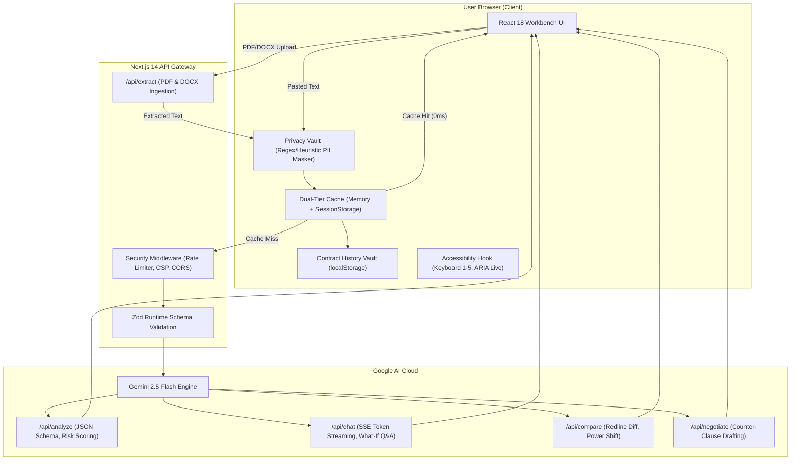

# LexiGuard AI

> **AI for Legal Assistance & Access**  
> An accessible contract review and negotiation copilot built for freelancers, tenants, and small business owners.  
> Translates dense legalese into plain English, flags one-sided traps, and drafts balanced counter-clauses.

[](https://github.com/HarshitDhaduk/LexiGuard-AI/actions/workflows/ci.yml)
[](https://lexi-guard-ai-phi.vercel.app/)
[](LICENSE)
[](tests/)
[](https://www.w3.org/WAI/WCAG21/quickref/)

---

## The Problem

Most people sign contracts without truly understanding what they're agreeing to. Hiring a contract attorney costs between **$250 and $650/hour**, which is simply out of reach for freelancers, tenants, and small businesses. As a result, people routinely sign agreements containing hidden indemnity traps, unilateral IP transfers, or unfair termination penalties.

**LexiGuard AI** levels the playing field. It deconstructs contracts into plain English, scores risk, identifies missing protections, and helps users draft fair counter-clauses—without letting sensitive personal data leak to external servers.

*Disclaimer: LexiGuard provides informational assistance and contract education. It does not provide formal legal counsel or establish an attorney-client relationship.*

---

## Tech Stack

- **AI Engine**: Google Gemini 2.5 Flash (`gemini-2.5-flash`) via `@google/generative-ai`
- **Framework**: Next.js 14 (App Router, Serverless Edge API Routes)
- **Document Parsing**: `unpdf` (PDF text extraction) + `mammoth` (Word .docx parsing)
- **Language**: TypeScript 5 (Strict type checking, zero `any`)
- **Styling**: Tailwind CSS (WCAG 2.1 AAA high-contrast tokens, responsive layout)
- **Validation**: Zod 4 (Strict runtime boundary schema validation on all endpoints)
- **Icons**: Lucide React
- **Testing**: Vitest (104 unit and integration tests across 16 suites)
- **Hosting & CI**: Vercel (Edge deployment) + GitHub Actions (Automated CI on push)

---

## System Architecture



---

## Core Features

1. **Universal Contract Ingestion & Vault**: Drag-and-drop PDF, Word (`.docx`), or Markdown contracts up to 10MB or paste directly. Contracts are automatically saved to your private local storage vault for 0ms re-auditing.
2. **Client-Side Privacy Vault**: In-browser engine automatically redacts names, compensation, emails, phone numbers, and bank details before anything is sent over the network.
3. **Clause Radar & Risk Heatmap**: Evaluates each clause on a 0–100 risk scale, highlights "The Trap", and explains the practical consequences.
4. **Plain English De-Jargonizer**: Calculates Flesch-Kincaid Grade Level and Reading Ease, showing an objective clarity improvement (from post-grad legal speak down to Grade 7–8 clarity).
5. **Omission Radar**: Flags critical terms that the drafting party intentionally left out (such as mutual cure periods, audit caps, or late payment terms).
6. **Bilateral Redline Diff**: Compares two versions of an agreement (with direct PDF/DOCX upload for baseline and counterparty redline) and calculates the **Power Shift Index (-100 to +100)** to show who gained leverage.
7. **Grounded What-If Simulator**: Real-time streaming Q&A (<250ms TTFT) strictly grounded in contract text with section-level citations.
8. **Negotiation Studio**: Generates balanced or protective counter-clauses and a polite, ready-to-send negotiation email.
9. **Lawyer Briefing Dossier**: Exports a 1-page structured briefing document with prioritized questions to minimize attorney consultation costs.

---

## Architecture Decisions & Trade-Offs

- **Gemini 2.5 Flash over Pro**: We prioritized sub-second response times and token streaming over slow multi-step reasoning models. Flash handles 60k-character agreements smoothly at minimal latency and cost.
- **Client-Side Heuristic PII Masking**: We chose browser-side regex/heuristic masking rather than a server-side NER model. This guarantees that unredacted personal details never leave the user's device, trading off rare edge-case detection for total privacy.
- **Dual-Tier Cache (Memory + SessionStorage)**: Repeat queries and preset toggles return in **0ms** without network requests or external Redis hosting fees.
- **Dynamic Code-Splitting**: Secondary modules are loaded on demand via `next/dynamic`, shrinking the initial JavaScript bundle to just **115 kB**.
- **Informational vs. Advisory**: The platform deliberately steers clear of legal practice. It de-jargonizes and educates without giving legal directives.

---

## Accessibility (WCAG 2.1 AAA)

- **High-Contrast Palette**: All text elements meet or exceed 7:1 contrast against dark backgrounds.
- **Single-Key Shortcuts**: Press `1`–`5` to switch tabs, `?` to open the guided tour, and `Esc` to close modals.
- **Screen Reader Announcements**: Live state changes and analysis progress are broadcast via `aria-live="polite"`.
- **Motion Safety**: Respects `prefers-reduced-motion` for users sensitive to animations.

---

## Quickstart

```bash
# 1. Clone & install
git clone https://github.com/HarshitDhaduk/LexiGuard-AI.git
cd LexiGuard-AI
npm install

# 2. Add API key (optional for offline testing; presets work out of the box)
cp .env.example .env.local
# Add: GEMINI_API_KEY=your_key_here

# 3. Run tests (88 tests passing)
npm test

# 4. Start local development server
npm run dev
```

Visit [http://localhost:3000](http://localhost:3000) to view the application.

---

## License

MIT License. See [LICENSE](LICENSE) for details.
