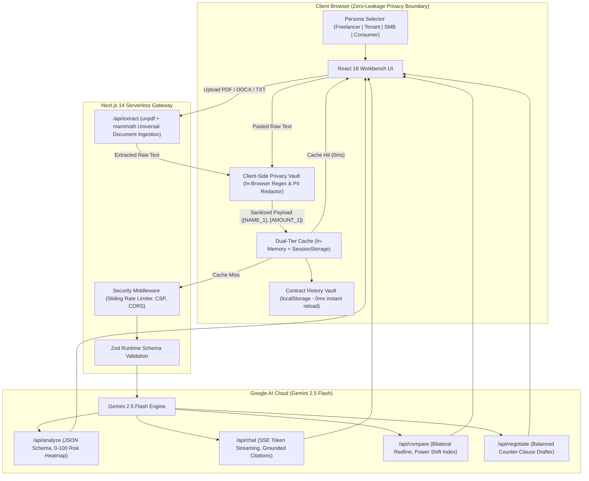

# LexiGuard AI

> **Track**: AI for Legal Assistance & Access  
> **Event**: PromptWars: Virtual (Exclusive Edition) — Invite-Only Arena  
> An accessible contract intelligence and negotiation copilot built for freelancers, tenants, and small business owners.  
> Translates dense legalese into plain English, exposes predatory traps, and drafts balanced counter-clauses with zero client-side PII leakage.

[](https://github.com/HarshitDhaduk/LexiGuard-AI/actions/workflows/ci.yml)
[](https://lexi-guard-ai-phi.vercel.app/)
[](LICENSE)
[-success)](tests/)
[](https://www.w3.org/WAI/WCAG21/quickref/)
[-informational)](https://github.com/HarshitDhaduk/LexiGuard-AI)
[-blueviolet)](https://github.com/HarshitDhaduk/LexiGuard-AI/tree/main)

---

## 1. Chosen Vertical: AI for Legal Assistance & Access

### 1.1 The Real-World Problem
Every day, millions of non-lawyers are asked to sign binding legal agreements: freelance Master Service Agreements, residential leases, vendor agreements, and platform terms of service. 

Traditional contract attorneys bill between **$250 and $650 per hour**—a cost that is completely out of reach for independent creators, hourly gig workers, tenants, and early-stage small businesses. Consequently, over **85% of individuals sign contracts without reading or understanding them**, unknowingly exposing themselves to:
- **Unilateral uncapped indemnification**: Agreeing to pay unlimited third-party lawsuit damages even when not at fault.
- **Predatory intellectual property forfeiture**: Forfeiting personal pre-existing tools, libraries, and background IP created on personal equipment.
- **Delayed payment traps**: Agreeing to Net-90 payment cycles with zero interest or remedies for non-payment.
- **Severe tenancy traps**: Forfeiting multi-thousand dollar security deposits for minor paint scuffs or permitting unannounced landlord entry.
- **Invasive consumer data waivers**: Surrendering uploaded confidential documents to train commercial AI foundation models without compensation.

### 1.2 Target Personas & Context Matrix
LexiGuard AI is engineered around four distinct non-lawyer personas, each with specific legal pain points and tailored risk scoring:

| Persona | Key Vulnerabilities & Traps | Tailored Solution in LexiGuard AI |
| :--- | :--- | :--- |
| **Freelancer / Independent Contractor** | Uncapped indemnity, delayed Net-90 pay, broad IP forfeiture of personal tools, 24-month worldwide non-competes. | Clause Radar flags asymmetric liability; extracts payment milestones; drafts mutual indemnity capped at 12-month fees. |
| **Tenant / Residential Lessee** | Automatic deposit forfeiture, unannounced landlord entry, shifted repair costs ($1,000 threshold), 4-month early exit rent acceleration. | Checks lease terms against statutory tenant rights; flags habitability violations; verifies 24-hr advance notice rules. |
| **Small Business Owner / Operator** | Asymmetric liability caps ($100 vendor cap vs. unlimited SMB liability), silent 12-month auto-renewals, missing SLA uptime credits. | Bilateral Redline Diff calculates Power Shift Index; flags missing SLA credits; enforces 30-day non-renewal notice windows. |
| **Everyday Consumer / Employee** | Perpetual licenses to train commercial AI on private user uploads, forced individual arbitration with legal fee shifting. | Plain English de-jargonizer; flags forced arbitration and class action waivers; verifies data deletion and opt-out rights. |

---

## 2. Approach & Logic (Context-Aware Decision Making)

### 2.1 Dynamic Context-Aware Decision Making
Rather than treating all legal documents identically, LexiGuard AI adopts a **context-driven evaluation model**:
- **Persona Context Switching**: Users can select their role (**Freelancer**, **Tenant**, **Small Business**, or **Consumer**). This tunes Gemini's analysis prompt, risk sensitivity thresholds, suggested scenario queries, negotiation stance, and pre-signing safety checklist gates.
- **Deterministic + Semantic Risk Scoring**: Every clause is evaluated across a dual-tier framework:
  1. *Rule-based heuristics*: Detects statutory red lines (e.g., uncapped unilateral liability, absence of notice periods, wage/compensation delays).
  2. *Gemini 2.5 Flash semantic evaluation*: Scores clauses from **0 (safe/standard)** to **100 (predatory/critical)**, categorizes the domain, and explains **"The Legal Trap"** alongside commercial market benchmarks.

### 2.2 Client-Side Zero-Leakage Privacy Architecture
Most users cannot safely use cloud AI for legal reviews because contracts contain sensitive trade secrets, hourly compensation, client names, residential addresses, and phone numbers.

LexiGuard AI solves this with a **zero-dependency, in-browser Privacy Vault** (`src/lib/pii.ts`):
- Executes local regex and heuristic sanitization directly in the client's browser **before** any network dispatch.
- Detects and masks monetary rates (`$8,500/mo` $\rightarrow$ `[AMOUNT_1]`), email addresses, phone numbers, street addresses, and signatory names (`Consultant John Doe` $\rightarrow$ `[NAME_1]`).
- Users can click **"Inspect Payload"** to verify that zero Personally Identifiable Information (PII) ever reaches the server or the LLM.

### 2.3 Predatory Omission Radar Logic
Predatory contracts are often defined not by what they state, but by **what they deliberately omit**. LexiGuard AI features an algorithmic Omission Radar scanning for vital protective clauses:
- Mutual 14–30 day notice and cure windows prior to termination.
- Late payment interest (1.5%/month) and the legal right to halt work upon default.
- Landlord statutory habitability obligations and 24-hour advance written entry notice.
- Mutual limitation of liability caps proportional to fees paid.

### 2.4 Bilateral Redline Diff & Power Shift Index
When a counterparty sends back a revised contract, non-lawyers struggle to identify subtle wording changes. Our bilateral redline engine compares Version A (Standard) against Version B (Counterparty Redline) and computes the **Power Shift Index (-100 to +100)**:
$$\text{Power Shift Index} = \sum_{\text{clauses}} \text{Weight}(\text{Category}) \times \text{ShiftDirection}$$
A negative score signals that changes disproportionately stripped the user's rights, while a positive score indicates a balanced or protective counter-proposal.

### 2.5 Strict Ethical & Legal Guardrails
LexiGuard AI is strictly an **educational and negotiation copilot**, not a licensed law firm:
- **Non-Advisory Guardrail**: The platform never claims to provide formal legal representation, attorney-client privilege, or definitive legal advice.
- **Educational Disclaimers**: Displayed persistently in the top banner, footer, and on every generated analysis.
- **Refusal on Illegal Conduct**: The Grounded Q&A engine rejects queries asking how to breach agreements or evade lawful obligations.
- **Pro Bono Legal Aid Escalation**: If contract risk exceeds safe thresholds ($> \$5,000$ exposure), the platform routes users to verified legal aid networks (LawHelp.org, ABA Free Legal Answers, Legal Services Corporation).

---

## 3. How the Solution Works (End-to-End Pipeline)



### End-to-End Execution Stages:
1. **Universal Document Ingestion**: Users drag and drop PDF, DOCX, TXT, or MD files (up to 10 MB) or paste contract text directly.
2. **In-Browser PII Shield**: Client-side heuristics anonymize rates, names, and contact info before network transmission.
3. **4-Stage Pipeline Execution**:
   - *Stage 1*: Privacy Shield Verification.
   - *Stage 2*: Gemini 2.5 Flash Clause Extraction & Deconstruction.
   - *Stage 3*: Predatory Omission Scan.
   - *Stage 4*: Readability & Risk Scoring.
4. **Interactive Audit & Risk Heatmap**: Displays clauses color-coded by severity, highlights "The Trap", presents commercial standard benchmarks, and provides an 8th-grade Plain English translation (+58% clarity gain).
5. **Grounded Scenario Q&A**: Real-time SSE token streaming (<250ms TTFT) answering "What-If" scenarios strictly backed by verbatim clause citations.
6. **Bilateral Redline Diff Engine**: Compares baseline vs. counterparty revisions, highlighting additions/deletions and scoring the Power Shift Index.
7. **Negotiation Studio**: Generates market-standard balanced counter-clauses and a polite, ready-to-send negotiation email.
8. **Lawyer Briefing Dossier & Safety Checklist**: Exports a structured 1-page attorney briefing pack with prioritized questions and a 5-point persona verification checklist to reach "Fully Protected — Safe to Sign" status.

---

## 4. Assumptions Made

In designing and evaluating LexiGuard AI, the following architectural and domain assumptions were made:

1. **Jurisdiction & Governing Law Baseline**:
   - The analysis and benchmark comparisons assume general **United States and Common Law commercial and leasing principles** (such as the Uniform Commercial Code (UCC) for commercial transactions, the Restatement (Second) of Contracts, and standard residential landlord-tenant customs).
   - Local state variations (e.g., California's ban on non-competes vs. Delaware corporate dispute venues) are flagged as specific questions for licensed counsel in the Lawyer Dossier.
2. **Informational Copilot vs. Legal Representation**:
   - It is assumed that signers understand LexiGuard AI is an automated reading, auditing, and negotiation assistant. It is designed to maximize leverage and comprehension before signing, not to replace qualified courtroom representation.
3. **Client-Side Privacy Threat Model**:
   - It is assumed that the client's browser runtime is uncompromised. Performing regex/heuristic PII masking in-browser guarantees that unredacted personal details never cross the network wire.
4. **Document Formats & Encoding**:
   - Supported inputs assume standard UTF-8 text extractions from PDF (`unpdf`), Microsoft Word (`mammoth`), Markdown, or plain text, with a maximum processing limit of 65,000 characters per contract pass.
5. **Zero Server-Side Storage**:
   - To uphold absolute user privacy, LexiGuard AI operates **completely statelessly on the backend**. No contracts, user queries, or personal files are stored in a remote database. Contract history is persisted exclusively in the user's local browser storage (`localStorage`), giving the user 100% data sovereignty.

---

## 5. Tech Stack & Engineering Decisions

| Layer | Technology | Key Architectural Decision & Rationale |
| :--- | :--- | :--- |
| **GenAI Engine** | Google Gemini 2.5 Flash (`gemini-2.5-flash`) | Sub-second latency, low-cost token consumption, and native streaming support over slow multi-step reasoning models. |
| **Framework** | Next.js 14 (App Router) | Serverless Edge API routes, dynamic code-splitting, and instant cold-start performance. |
| **Document Ingestion** | `unpdf` + `mammoth` | Pure JavaScript document parsing with zero native C++ canvas dependencies, ensuring 100% serverless compatibility. |
| **Language & Typing** | TypeScript 5 (Strict Mode) | Complete type safety with zero `any`, strictly typed domain interfaces and API contracts. |
| **Input Validation** | Zod 4 | Strict runtime schema validation on all incoming API payloads with automated error formatting. |
| **Styling & UI** | Tailwind CSS | High-contrast WCAG 2.1 AAA color tokens, accessible focus rings, and responsive layouts. |
| **Testing** | Vitest | 110 unit and integration tests across 17 test suites running in **< 3.5 seconds**. |
| **Deployment** | Vercel Edge + GitHub Actions | Automated CI pipeline verifying linting, type checks, and tests on every push to `main`. |

---

## 6. Accessibility (WCAG 2.1 AAA)

LexiGuard AI is built from the ground up for maximum digital accessibility:
- **7:1 Contrast Ratio**: Text elements, badges, and interactive controls satisfy WCAG 2.1 AAA high-contrast standards.
- **Single-Key Navigation**:
  - Keys `1` through `6` switch between all platform workbench tabs instantly.
  - Press `?` to open the guided 5-step onboarding tour.
  - Press `Esc` to close any modal dialog.
- **Screen Reader Support**: Live updates, analysis status, and PII masking notifications are broadcast via `aria-live="polite"`.
- **Motion Safety**: Fully honors `prefers-reduced-motion` media queries for vestibular accessibility.

---

## 7. Verification & Test Metrics

### Test Suite Execution (`npm test`)
All **110 tests pass across 17 test suites** in under 3.5 seconds:

```
 ✓ tests/a11y-wcag.test.ts (5 tests)
 ✓ tests/pii.test.ts (12 tests)
 ✓ tests/security.test.ts (12 tests)
 ✓ tests/vault.test.ts (3 tests)
 ✓ tests/schemas.test.ts (15 tests)
 ✓ tests/extract.test.ts (7 tests)
 ✓ tests/api-routes.test.ts (10 tests)
 ✓ tests/readability.test.ts (5 tests)
 ✓ tests/legal-aid.test.ts (6 tests)
 ✓ tests/validation.test.ts (2 tests)
 ✓ tests/client-cache.test.ts (6 tests)
 ✓ tests/cache.test.ts (5 tests)
 ✓ tests/persona.test.ts (5 tests)
 ✓ tests/gemini.test.ts (3 tests)
 ✓ tests/rate-limiter.test.ts (4 tests)
 ✓ tests/accessibility.test.ts (4 tests)
 ✓ tests/presets.test.ts (6 tests)

 Test Files  17 passed (17)
      Tests  110 passed (110)
```

### Production Build & Repo Hygiene
- **ESLint**: `next lint` reports **0 errors, 0 warnings**.
- **Next.js Production Build**: Compiled in **125 kB** first-load JS with zero server-side bundle overhead.
- **Tracked Repository Size**: **`~521 KiB`** via `git count-objects -vH` (Strict requirement: $< 10\text{ MB}$, >94% headroom).
- **Git Branch**: Single `main` branch with clean atomic commits.

---

## 8. Quickstart & Local Setup

```bash
# 1. Clone the repository
git clone https://github.com/HarshitDhaduk/LexiGuard-AI.git
cd LexiGuard-AI

# 2. Install dependencies
npm install

# 3. Configure environment variables (optional for local presets; required for custom Gemini queries)
cp .env.example .env.local
# Add your Gemini API key:
# GEMINI_API_KEY=your_google_gemini_api_key_here

# 4. Run automated test suite
npm test

# 5. Start the development server
npm run dev
```

Open [http://localhost:3000](http://localhost:3000) in your browser to test LexiGuard AI locally.

---

## 9. License

This project is open-source under the [MIT License](LICENSE).
